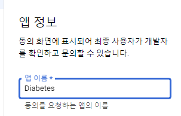
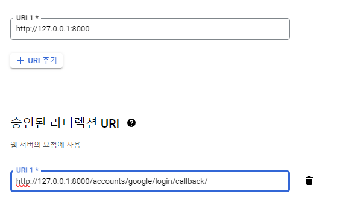
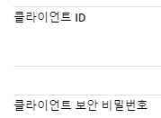

```bash
## settings.py
```
```
INSTALLED_APPS = [
    "django.contrib.admin",
    "django.contrib.auth",
    "django.contrib.contenttypes",
    "django.contrib.sessions",
    "django.contrib.messages",
    "django.contrib.staticfiles",
    'survey',
    # google login part start
    'django.contrib.sites',
    'allauth',
    'allauth.account',
    'allauth.socialaccount',
    'allauth.socialaccount.providers.google'
    # end
]

```

```bash
MIDDLEWARE = [
    "django.middleware.security.SecurityMiddleware",
    "django.contrib.sessions.middleware.SessionMiddleware",
    "django.middleware.common.CommonMiddleware",
    "django.middleware.csrf.CsrfViewMiddleware",
    "django.contrib.auth.middleware.AuthenticationMiddleware",
    "django.contrib.messages.middleware.MessageMiddleware",
    "django.middleware.clickjacking.XFrameOptionsMiddleware",
    
    # add this code
    "allauth.account.middleware.AccountMiddleware"
]
```

```bash
DEFAULT_AUTO_FIELD = "django.db.models.BigAutoField"
# add this code in bottom
AUTHENTICATION_BACKENDS = [
    # Needed to login by username in Django admin, regardless of `allauth`
    'django.contrib.auth.backends.ModelBackend',

    # `allauth` specific authentication methods, such as login by e-mail
    'allauth.account.auth_backends.AuthenticationBackend',
]

SITE_ID = 1

ACCOUNT_EMAIL_REQUIRED = True
ACCOUNT_EMAIL_VERIFICATION = 'none'
```

```bash
# urls.py
```

```bash
urlpatterns = [
    # add this code start
    path("accounts/", include('allauth.urls')),
    # end
    path("survey/", include('survey.urls')),
    path("admin/", admin.site.urls),
]

```

```bash
poetry add django-allauth PyJWT cryptography
```

```bash
poetry migrate
```

```bash
go url => https://console.developers.google.com/

click!


click!


insert!


null!


click!


insert!


click!


go!


click!


click!


click!


insert!


copy!



```